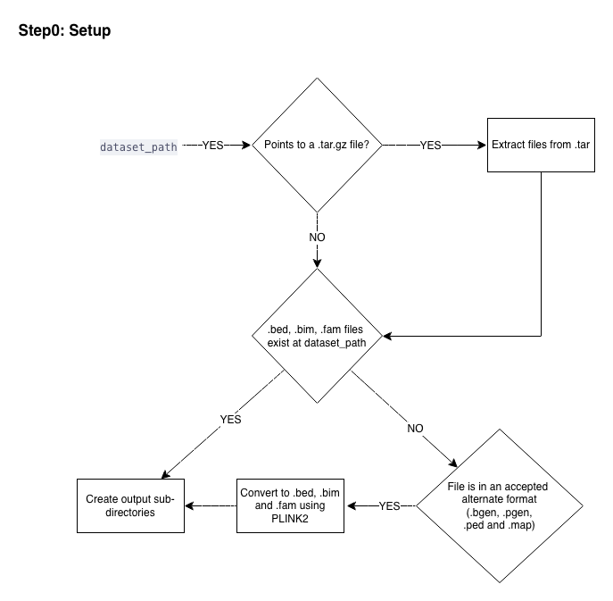
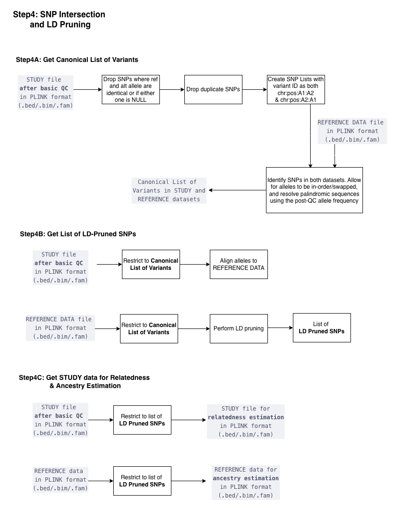
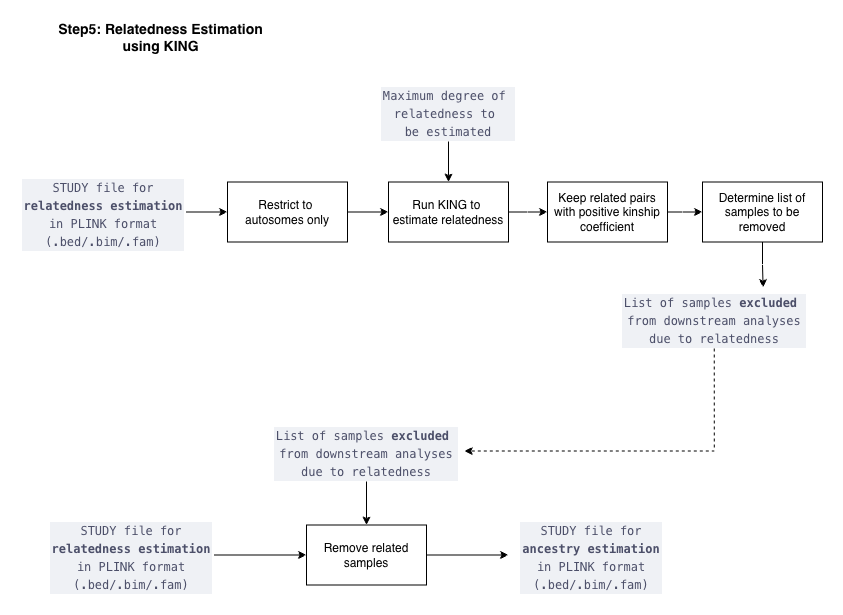
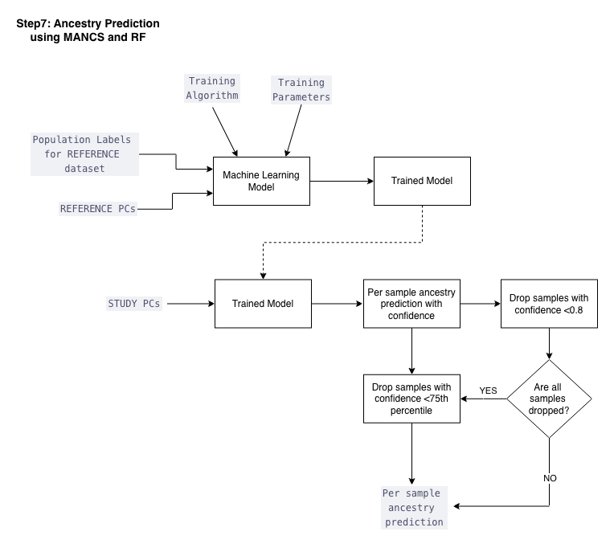
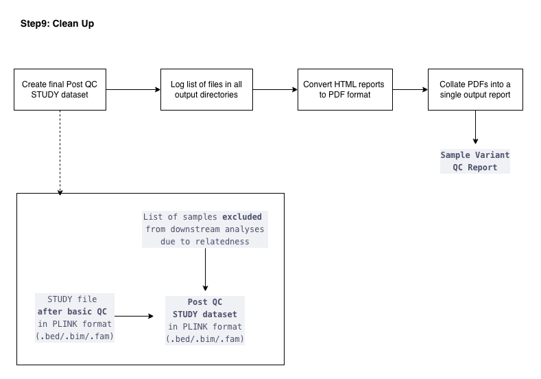

---
---

<div style="display: flex; justify-content: space-between; align-items: center;">
  <a href="../index.html">⬅️ Return to Homepage</a>
  <a href="../pre_phasing_checks.html">Go to Step 2 [Pre-Phasing Checks] ➡️</a>
</div>

# Sample Variant QC Pipeline — Detailed Guide

## Overview

This repository contains scripts and utilities for running a comprehensive sample variant quality control (QC) pipeline, including ancestry prediction and per-chromosome QC reporting. The containerized implementation ensures reproducible execution across different computing environments.

## Features

- **Automated Build Detection** (hg37/hg38) with liftover using progressive MAF filtering strategies
- **Comprehensive QC** filtering and statistics with customizable thresholds
- **Ancestry Prediction** using 1000G + HGDP reference data with MANCS or Random Forest algorithms
- **Principal Component Analysis** for population structure with projection capabilities
- **Kinship Analysis** using KING to identify related samples
- **Interactive Reports** with consistent styling and comprehensive plots
- **Containerized** execution with Docker/Singularity/Apptainer support
- **Multi-format Input Support** (.bed/.bim/.fam, BGEN, .pgen, .ped/.map, compressed archives)

## Requirements

- Docker, Singularity or Apptainer
- 8GB+ RAM, 50GB+ storage recommended
- Linux/macOS (Windows via WSL)
- Bash shell
- (Optional) R and Python if running outside the container

## Input/Output

**Accepts:** PLINK files (.bed/.bim/.fam), BGEN, .pgen, .ped/.map, compressed archives (.tar.gz)  
**Produces:** QC'd genotypes, ancestry labels, PCs, kinship results, HTML/PDF reports

## Directory Structure

```bash
sample_variant_qc/
├── scripts/                 # Main pipeline and stepwise shell scripts
├── utils/                   # R scripts, plotting, and support utilities  
├── data/                    # Input data (e.g., population files)
├── output/                  # Output directory for results and reports
├── config/
│   ├── parameters.txt       # Configuration file for pipeline variables
│   └── mounts.txt          # Mount path definitions
├── Dockerfile              # Docker image definition
└── SAMPLE_VARIANT_QC_RUNNER.sh  # Main execution script
```

## Output Structure

```bash
output/
└── STUDY_NAME_Outputs/
    ├── Ancestry/                    # Ancestry predictions and population labels
    ├── AncestrySpecificPCA/         # Population-specific principal components
    ├── Kinship/                     # Relatedness analysis results
    ├── Logs/                        # Pipeline execution logs and error messages
    ├── PCA/                         # Principal component analysis outputs
    ├── PostBasicQC/                 # Genotype files after basic QC filtering
    ├── PostQC_PerChromosome/        # QC'd data split by chromosome
    ├── PostQCStats_PerChromosome/   # QC statistics per chromosome
    ├── PostSampleVariantQC/         # Final QC'd genotype files
    ├── PreQCStats/                  # Pre-QC baseline statistics
    ├── PreQCStats_PerChromosome/    # Pre-QC statistics per chromosome
    └── Reports/                     # HTML and PDF summary reports
```

## Default QC Thresholds

- **Build check:** Requires ≥80% variant overlap between study and reference data (tested with no MAF threshold, MAF>1% and MAF>5%)
- **Sample call rate:** 90% (0.9)
- **Variant call rate:** 90% (0.9)  
- **Minor allele frequency:** 0.1% (0.001)
- **Minor allele count:** ≥5
- **Hardy-Weinberg equilibrium:** p > 1e-12 for homogeneous cohorts, p > 1e-6 for mixed ancestry cohorts
- **Sample heterozygosity:** outliers based on heterozygosity (configurable method)
- **Kinship threshold:** 0.354 (MZ twins/duplicates only)
- **Ancestry prediction algorithm:** MANCS (Multi-Ancestry Nearest Control Selection)
- **Ancestry confidence:** 80% (0.8), fallback to 75% if no samples meet 80%

*All thresholds are customizable via `parameters.txt`*

## Reference Data

Uses harmonized 1000 Genomes + HGDP data:

- **3,280 samples**, 8.15M high-quality variants
- **Continental ancestry labels** (AFR, AMR, EAS, EUR, SAS)
- **Available in hg37 and hg38 builds**
- **Source:** gnomAD v3.1.2 HGDP + 1KG subset with additional QC filtering

## Quick Start

1. **Clone the GitHub repository:**

   ```bash
   git clone git@github.com:giant-consortium/sample_variant_qc.git
   cd sample_variant_qc
   chmod +x SAMPLE_VARIANT_QC_RUNNER.sh
   ```

2. **Edit `parameters.txt`** to set paths and options for your data. The `path_to_data` and `study_name` are altered in every execution. Always set `study_name` to match the base name of your PLINK files (no file extensions).

   ```bash
   # Example: If your files are named STUDY4_SAS.bed, STUDY4_SAS.bim, STUDY4_SAS.fam
   study_name=STUDY4_SAS
   ```

   **Note:** If these are stored in a compressed form (.tar.gz) or in alternate formats (.ped/.map, .bgen) the conversion to PLINK is done automatically. Do not include the file extension in the `study_name` parameter.

3. **Run the pipeline:**

   ```bash
   # With Docker
   ./SAMPLE_VARIANT_QC_RUNNER.sh --docker

   # With Singularity
   ./SAMPLE_VARIANT_QC_RUNNER.sh --singularity

   # With Apptainer
   ./SAMPLE_VARIANT_QC_RUNNER.sh --apptainer

   # To force data download:
   ./SAMPLE_VARIANT_QC_RUNNER.sh --docker --force_data_download

   # To get the most recent containers:
   ./SAMPLE_VARIANT_QC_RUNNER.sh --docker --get_update
   ```

4. **Outputs** will be saved in a sub-folder named `study_name` at the path specified by `path_to_output` in `parameters.txt`.

## Pipeline Overview

The pipeline performs the following steps:

1. **Setup & Format Conversion** - Convert input to PLINK format
2. **Build Detection** - Determine hg37/hg38 and liftover if needed  
3. **Pre-QC Statistics** - Generate baseline quality metrics
4. **Basic QC** - Filter samples/variants (call rate, MAF, MAC, HWE, heterozygosity)
5. **SNP Intersection & LD Pruning** - Align with reference data, prepare for relatedness and ancestry estimation
6. **Relatedness Estimation** - Identify related samples using KING
7. **PCA Generation** - Calculate population structure covariates
8. **Ancestry Prediction** - Assign continental ancestry labels
9. **Ancestry-Specific PCA** - Generate population-specific PCs
10. **Reporting** - Create comprehensive HTML/PDF reports

## Workflow Diagram


## Troubleshooting

- Check the log files in the `./output/study_name/Logs` directory for errors.
- Ensure all required paths in `parameters.txt` are correct and accessible.
- Stepwise outputs are in the `./output/study_name/` directory.
- For container issues, verify your container runtime is installed and running.
- If build detection fails, check variant overlap diagnostics in the logs.

---

## Pipeline Implementation Details

The following sections walk through each pipeline step in detail, covering the scripts involved, implementation logic, and technical specifics. This is intended for users who want a deeper understanding of what happens at each stage, or who need to troubleshoot or customize the pipeline behavior.

### Jump to a Step

| Step | Name | Script |
|------|------|--------|
| [0](#step-0-setup-and-format-conversion) | Setup and Format Conversion | `Step0_Setup.sh` |
| [1](#step-1-build-detection-and-liftover) | Build Detection and Liftover | `Step1_CheckBuild.sh` |
| [2](#step-2-pre-qc-statistics) | Pre-QC Statistics | `Step2_PreQC.sh` |
| [3](#step-3-basic-sample-and-variant-level-qc) | Basic Sample and Variant-Level QC | `Step3_BasicQC.sh` |
| [4](#step-4-snp-intersection-and-ld-pruning) | SNP Intersection and LD Pruning | `Step4_SNPIntersectForPCA.sh` |
| [5](#step-5-relatedness-estimation) | Relatedness Estimation | `Step5_KinshipTest.sh` |
| [6](#step-6-principal-component-analysis) | Principal Component Analysis | `Step6_PCA.sh` |
| [7](#step-7-ancestry-prediction) | Ancestry Prediction | `Step7_AncestryModel.sh` |
| [8](#step-8-ancestry-specific-pca) | Ancestry-Specific PCA | `Step8_AncestrySpecificPCA.sh` |
| [9](#step-9-cleanup-and-reporting) | Cleanup and Reporting | `CleanUp.sh` |

### SAMPLE_VARIANT_QC_RUNNER.sh

This file configures paths, performs data downloads, and builds the Docker image. Once built, it calls the Docker image with the passed parameters and executes the complete workflow.

**Key Steps:**

1. **Set mount paths** to study dataset, reference data, build check data and output
2. **Check Docker installation** and verify Docker is running
3. **Download reference data** if not present or if `--force_data_download` flag is set
4. **Build Docker image** if not present or if `--force_build` flag is set
5. **Execute containerized pipeline** with mounted data and parameters

**Performance Notes:**

- Reference data download: ~15 minutes
- Docker image build: ~30 minutes
- Dangling images and volumes are removed during rebuild to save disk space

**Configuration:**

- Mount paths defined in `config/mounts.txt`
- Environment variables set via `config/parameters.txt`
- Both files can be modified between runs without rebuilding the image

### Reference Datasets

**Data Source:** 1000 Genomes (1KG) and Human Genome Diversity Project (HGDP) datasets, harmonized by gnomAD

**Location:** `gs://gcp-public-data--gnomad/release/3.1.2/mt/genomes/gnomad.genomes.v3.1.2.hgdp_1kg_subset_dense.mt`

**Processing Pipeline:**

1. **Sample filtering:** Excluded low-quality and related samples identified by gnomAD, resulting in **3,280 samples**
2. **Variant QC using PLINK2:**
   - Minor Allele Frequency ≥ 1%
   - Hardy-Weinberg Equilibrium p-value > 1e-6
   - Variant call rate ≥ 98%
   - SNPs only (A,C,G,T restriction)
3. **Final dataset:** **8.15M high-quality variants**
4. **Build availability:** hg38 (primary) and hg37 (liftover)

### Development Environment (Dockerfile)

**Base System:** Ubuntu 22.04

**Core Tools:**

- **Python3** with pandas, numpy, matplotlib, scipy, json, sklearn
- **R** with data.table, kableExtra, knitr, rmarkdown, pandoc
- **FlashPCA** with dependencies (eigen3, boost, spectra)
- **PLINK2** and **PLINK1.9**

**Installation:** All dependencies installed via apt-get, scripts made executable with chmod

---

### Detailed Pipeline Steps

#### Step 0: Setup and Format Conversion

**Script:** `Step0_Setup.sh`



1. **Binary setup:** Copy PLINK1.9 and PLINK2 binaries to `/` directory
2. **Format detection and conversion:** Convert study files to PLINK format
   - If `dataset_path` points to a `.tar.gz` file, then extract contents
   - Else if `.bed/.bim/.fam` files exist at `dataset_path`, then proceed directly
   - Else if file is in an alternate format (`.bgen`, `.pgen`, `.ped/.map`), then convert to `.bed/.bim/.fam` using PLINK2
   - **`.pgen` files** are converted to hard calls with dosage threshold = 0.1
   - **Output:** .bed/.bim/.fam format
3. **Directory creation:**
   - Study-specific output: `./output/<STUDY_NAME>_Outputs/`
   - Subdirectories: InitialQC, PCA, Kinship, Ancestry, Logs

#### Step 1: Build Detection and Liftover

**Script:** `Step1_CheckBuild.sh` | **Utility:** `./utils/check_build.R`


**Build Check Process:**

1. **Run BUILD CHECK** on the STUDY `.bim` file:
   - Calculate overlap between STUDY `.bim` and hg38 reference `.bim`. If overlap ≥80%, then build check **PASSED** (hg38)
   - Else if overlap <80% with hg38, calculate overlap with hg37 reference `.bim`. If overlap ≥80%, then perform **liftOver** from hg37 to hg38
   - Else if overlap <80% with both, then build check **FAILED**
2. **Progressive MAF filtering** (if initial build check fails):
   - **Retry 1:** Keep variants with MAF > 5% in STUDY `.bim`, re-run BUILD CHECK
   - **Retry 2:** Keep variants with MAF > 1% in STUDY `.bim`, re-run BUILD CHECK
   - If all attempts fail, then provide detailed diagnostics and exit
3. **ChrX handling:** Include chrX if present during build check (accepts chr23/chrX notation)
4. **rsID preservation:** Maintain existing rsIDs when available
5. **Output:** STUDY file in PLINK format (hg38) — `.bed/.bim/.fam`

**Liftover Process (if hg37 detected):**

**Script:** `./utils/convert_to_hg38.sh`

1. Download UCSC liftover chain file
2. Set reference alleles according to hg37 reference
3. Perform coordinate conversion
4. Archive original files with `_hg37` suffix

#### Step 2: Pre-QC Statistics

**Script:** `Step2_PreQC.sh` | **Report:** `./utils/report_qc_stats.Rmd`


**Calculate pre-QC statistics:**

- **Per-variant:** HWE p-values, allele frequencies, call rates
- **Per-sample:** Call rate, heterozygosity
- **Multiallelic count:** Get number of multiallelic variants

**Sex check (conditional):**

- If chrX data is present, then run sex check using PLINK1.9
- Else if chrX data is absent, then skip sex check

**Per-chromosome statistics (conditional on data type):**

- **WGS data:** Calculate per-chromosome pre-QC statistics for all chromosomes
- **Array data:** Proceed directly to Step 3 (Basic QC)

#### Step 3: Basic Sample and Variant-Level QC

**Script:** `Step3_BasicQC.sh` | **Utility:** `./utils/filter_heterozygosity.py`


**Pre-filtering:** Restrict to bi-allelic variants

**Sample-Level QC:**

1. **Heterozygosity outliers:** Drop samples that are outliers based on heterozygosity (configurable)
2. **Sample call rate:** Drop samples with low call rate (default <90%)

**Variant-Level QC:**

1. **Variant call rate:** Drop variants with low call rate (default <90%)
2. **Hardy-Weinberg equilibrium:** Drop variants with low HWE p-values (default: p < 1e-12 for homogeneous cohorts, p < 1e-6 for mixed ancestry cohorts)
3. **Minor allele frequency:** Drop variants with low MAF (default: retain variants with MAF > 0.1%)
4. **Minor allele count:** Drop variants with low MAC (default: retain variants with MAC ≥ 5)

**Post-QC statistics (conditional on data type):**

- **WGS data:** Calculate per-chromosome post-QC statistics for **all** chromosomes
- **Array data:** Calculate per-chromosome post-QC statistics for **sex** chromosomes only

**Output:** QC'd STUDY file in PLINK format (`.bed/.bim/.fam`) in `./output/<study_name>/PostBasicQC/`

#### Step 4: SNP Intersection and LD Pruning

**Script:** `Step4_SNPIntersectForPCA.sh`



**Step 4A — Get Canonical List of Variants:**

1. **Quality filter:** Drop SNPs where ref and alt alleles are identical or if either one is NULL
2. **Duplicate removal:** Drop duplicate SNPs
3. **Variant ID standardization:** Create SNP lists with variant ID as both chr:pos:A1:A2 and chr:pos:A2:A1
4. **SNP intersection:** Identify SNPs in both study and reference datasets — allow for alleles to be in-order or swapped, and resolve palindromic sequences using the post-QC allele frequency
5. **Output:** Canonical list of variants in STUDY and REFERENCE datasets

**Step 4B — Get List of LD-Pruned SNPs:**

1. **Study restriction:** Restrict study file (after basic QC) to canonical list of variants, align alleles to REFERENCE DATA
2. **Reference restriction:** Restrict reference data to canonical list of variants
3. **LD pruning:** Perform LD pruning on the reference dataset, restricting to SNPs in the intersection
4. **Output:** List of LD-pruned SNPs

**Step 4C — Get STUDY Data for Relatedness & Ancestry Estimation:**

1. **Study file:** Restrict post-QC study data to list of LD-pruned SNPs. This produces the **STUDY file for relatedness estimation** (`.bed/.bim/.fam`)
2. **Reference file:** Restrict reference data to list of LD-pruned SNPs. This produces the **REFERENCE data for ancestry estimation** (`.bed/.bim/.fam`)

#### Step 5: Relatedness Estimation

**Script:** `Step5_KinshipTest.sh` | **Report:** `./utils/report_kinship.Rmd`



**Implementation:**

1. **Autosome restriction:** Restrict study file for relatedness estimation to autosomes only
2. **KING algorithm:** Run KING via PLINK2 to estimate pairwise relatedness, parameterized by maximum degree of relatedness to be estimated
3. **Filter related pairs:** Keep related pairs with positive kinship coefficient only
4. **Sample removal selection:** For each related set with kinship > 0.354 (default), retain the sample with least missingness
5. **Relationship classification:** MZ twins, 1st/2nd/3rd degree relatives
6. **Output:** List of samples **excluded** from downstream analyses due to relatedness
7. **Create ancestry file:** Remove related samples from the STUDY relatedness file. This produces the **STUDY file for ancestry estimation** (`.bed/.bim/.fam`)
8. **Visualization:** Kinship coefficient distributions and plots

#### Step 6: Principal Component Analysis

**Script:** `Step6_PCA.sh` | **Utility:** `./utils/plot_pca.R` | **Report:** `./utils/report_pca.Rmd`


**Implementation:**

1. **Reference PCA:** Run FlashPCA on REFERENCE data for ancestry estimation to generate PC space defined by PC loadings. This produces the **REFERENCE PC space**
2. **Study projection:** Project STUDY file for ancestry estimation onto REFERENCE PC space using FlashPCA. This produces the **STUDY PCs**
3. **PC count:** 15 PCs generated by default
4. **Sign alignment:** Ensure consistent PC orientations
5. **Visualization:** Multi-panel PC plots with population labels

**Standardized plotting:** Consistent formatting across all PCA visualizations using `./utils/plot_pca.R`

#### Step 7: Ancestry Prediction

**Script:** `Step7_AncestryModel.sh` | **Utility:** `./utils/train_pca_model.py` | **Report:** `./utils/report_ancestry_predictions.Rmd`



**Model training:**

1. **Inputs:** Population labels for REFERENCE dataset, REFERENCE PCs, training algorithm, training parameters
2. **Label processing:** Exclude 'oth' samples; combine NFE and FIN into EUR
3. **Algorithm options:**
   - **MANCS** (Multi-Ancestry Nearest Control Selection) - default
   - **Random Forest** with optional hyperparameter tuning
4. **Output:** Trained model

**Prediction and assignment:**

1. **Predict:** Apply trained model to STUDY PCs. This produces a per-sample ancestry prediction with confidence score
2. **Confidence thresholding:**
   - Drop samples with confidence < 0.8
   - If **all** samples are dropped at the 80% threshold, then fall back to dropping samples with confidence below the 75th percentile instead
3. **Output:** Per-sample ancestry prediction
4. **Visualization:** PC plots with ancestry predictions and confidence distributions

#### Step 8: Ancestry-Specific PCA

**Script:** `Step8_AncestrySpecificPCA.sh`


**Process:**

1. **Ancestry filtering:** For each continental ancestry label, get list of samples with the specified ancestry from per-sample predictions
2. **Minimum sample check:** Only proceed if the ancestry group has **> 2 samples**
3. **Projection:** Project samples of selected ancestry onto REFERENCE PC space using FlashPCA
4. **Output:** Ancestry-specific PC files for downstream association analyses

#### Step 9: Cleanup and Reporting

**Script:** `CleanUp.sh`



**Create final Post-QC dataset:**

1. **Combine exclusions:** Take STUDY file after basic QC and remove samples excluded due to relatedness (from Step 5). This produces the final **Post QC STUDY dataset** (`.bed/.bim/.fam`)

**Reporting and cleanup:**

1. **File logging:** Log list of files in all output directories
2. **Report conversion:** Convert HTML reports to PDF format
3. **Combined reporting:** Collate PDFs into a single output report, producing the final **Sample Variant QC Report**

> **Styling Note:** All HTML reports use consistent formatting via `./utils/qc_report_style.css`
