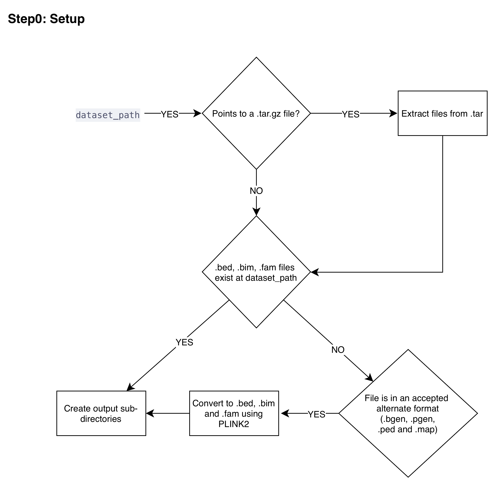

  <a href="./ind_geno_qc_detailed.html">⬅️ Back to Pipeline Overview</a>
  <a href="./ind_geno_qc_step1.html">Step 1: Build Detection and Liftover ➡️</a>

# Step 0: Setup and Format Conversion

**Script:** `Step0_Setup.sh`

---

## Steps

1. **Binary setup:** Copy PLINK1.9 and PLINK2 binaries to `/` directory
2. **Format detection and conversion:** Convert study files to PLINK format
   - If `dataset_path` points to a `.tar.gz` file, extract contents
   - Else if `.bed/.bim/.fam` files exist at `dataset_path`, proceed directly
   - Else if file is in an alternate format (`.bgen`, `.pgen`, `.ped/.map`), convert to `.bed/.bim/.fam` using PLINK2
   - **`.pgen` files** are converted to hard calls with dosage threshold = 0.1
   - **Output:** `.bed/.bim/.fam` format
3. **Directory creation:**
   - Study-specific output: `./output/<STUDY_NAME>_Outputs/`
   - Subdirectories: `InitialQC`, `PCA`, `Kinship`, `Ancestry`, `Logs`

---

  <a href="./ind_geno_qc_detailed.html">⬅️ Back to Pipeline Overview</a>
  <a href="./ind_geno_qc_step1.html">Step 1: Build Detection and Liftover ➡️</a>

