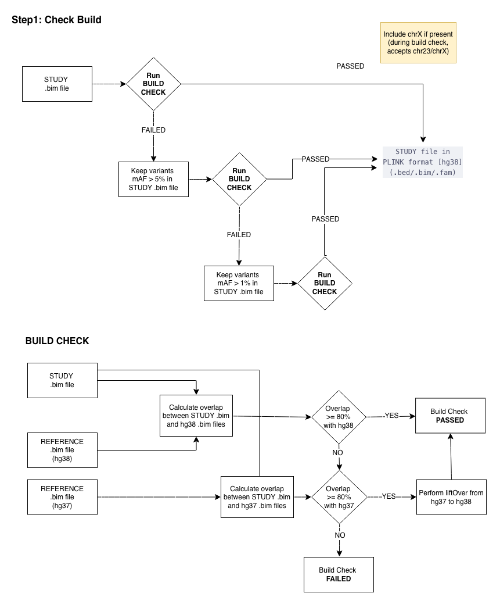

---
---

  <a href="./ind_geno_qc_step0.html">⬅️ Step 0: Setup and Format Conversion</a>
  <a href="./ind_geno_qc_step2.html">Step 2: Pre-QC Statistics ➡️</a>

[Back to Pipeline Overview](./ind_geno_qc_detailed.html)

# Step 1: Build Detection and Liftover

**Script:** `Step1_CheckBuild.sh` | **Utility:** `./utils/check_build.R`

---

## Build Check Process

1. **Run BUILD CHECK** on the STUDY `.bim` file:
   - Calculate overlap between STUDY `.bim` and hg38 reference `.bim`. If overlap ≥ 80%, build check **PASSED** (hg38)
   - Else if overlap < 80% with hg38, calculate overlap with hg37 reference `.bim`. If overlap ≥ 80%, perform **liftOver** from hg37 to hg38
   - Else if overlap < 80% with both, build check **FAILED**
2. **Progressive MAF filtering** (if initial build check fails):
   - **Retry 1:** Keep variants with MAF > 5% in STUDY `.bim`, re-run BUILD CHECK
   - **Retry 2:** Keep variants with MAF > 1% in STUDY `.bim`, re-run BUILD CHECK
   - If all attempts fail, provide detailed diagnostics and exit
3. **ChrX handling:** Include chrX if present during build check (accepts chr23/chrX notation)
4. **rsID preservation:** Maintain existing rsIDs when available
5. **Output:** STUDY file in PLINK format (hg38) — `.bed/.bim/.fam`

## Liftover Process (if hg37 detected)

**Script:** `./utils/convert_to_hg38.sh`

1. Download UCSC liftover chain file
2. Set reference alleles according to hg37 reference
3. Perform coordinate conversion
4. Archive original files with `_hg37` suffix

---

  <a href="./ind_geno_qc_step0.html">⬅️ Step 0: Setup and Format Conversion</a>
  <a href="./ind_geno_qc_step2.html">Step 2: Pre-QC Statistics ➡️</a>

