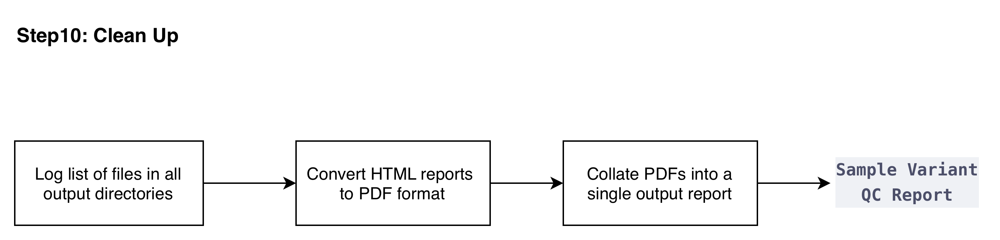

  <a href="./ind_geno_qc_step9.html">⬅️ Step 9: Ancestry-Specific PCA</a>
  <a href="./ind_geno_qc_detailed.html">⬅️ Back to Pipeline Overview</a>

[Back to Pipeline Overview](./ind_geno_qc_detailed.html)

# Step 10: Report Consolidation and Cleanup

**Script:** `Step10_ConsolidateAndClean.sh`

---

## Process

1. **Combine and convert reports:** Convert all main HTML reports to PDF using `weasyprint` and combine them into a single PDF using `gs` (Ghostscript).
2. **Copy outputs:** Copy the combined PDF report to the post-QC output directory for manifesting.
3. **Cleanup:** Remove intermediate PDF files, clean up temporary directories, and log the file structure before and after cleanup.
4. **Manifest generation:** If available, generate a manifest for all final outputs using a shared helper script.

---

  <a href="./ind_geno_qc_step9.html">⬅️ Step 9: Ancestry-Specific PCA</a>
  <a href="./ind_geno_qc_detailed.html">Back to Pipeline Overview ➡️</a>

