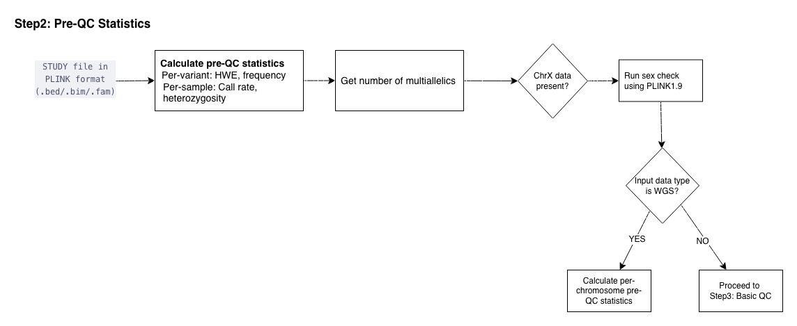

  <a href="./ind_geno_qc_step1.html">⬅️ Step 1: Build Detection and Liftover</a>
  <a href="./ind_geno_qc_step3.html">Step 3: Basic Sample and Variant-Level QC ➡️</a>

[Back to Pipeline Overview](./ind_geno_qc_detailed.html)

# Step 2: Pre-QC Statistics

**Script:** `Step2_PreQC.sh` | **Report:** `./utils/report_qc_stats.Rmd`

---

## Calculate Pre-QC Statistics

- **Per-variant:** HWE p-values, allele frequencies, call rates
- **Per-sample:** Call rate, heterozygosity
- **Multiallelic count:** Get number of multiallelic variants

## Sex Check (conditional)

- If chrX data is present, run sex check using PLINK1.9
- Else if chrX data is absent, skip sex check

## Per-Chromosome Statistics (conditional on data type)

- **WGS data:** Calculate per-chromosome pre-QC statistics for all chromosomes
- **Array data:** Proceed directly to Step 3 (Basic QC)

---

  <a href="./ind_geno_qc_step1.html">⬅️ Step 1: Build Detection and Liftover</a>
  <a href="./ind_geno_qc_step3.html">Step 3: Basic Sample and Variant-Level QC ➡️</a>

