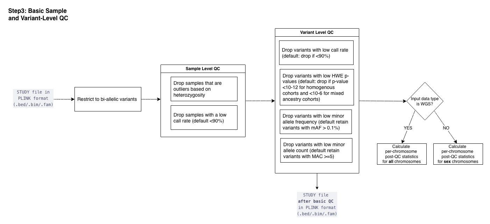

  <a href="./ind_geno_qc_step2.html">⬅️ Step 2: Pre-QC Statistics</a>
  <a href="./ind_geno_qc_step4.html">Step 4: SNP Intersection and LD Pruning ➡️</a>

[Back to Pipeline Overview](./ind_geno_qc_detailed.html)

# Step 3: Basic Sample and Variant-Level QC

**Script:** `Step3_BasicQC.sh` | **Utility:** `./utils/filter_heterozygosity.py`

---

## Pre-filtering

Restrict to bi-allelic variants.

## Sample-Level QC

1. **Heterozygosity outliers:** Drop samples that are outliers based on heterozygosity (configurable)
2. **Sample call rate:** Drop samples with low call rate (default < 90%)

## Variant-Level QC

1. **Variant call rate:** Drop variants with low call rate (default < 90%)
2. **Hardy-Weinberg equilibrium:** Drop variants with low HWE p-values (default: p < 1e-12 for homogeneous cohorts, p < 1e-6 for mixed ancestry cohorts)
3. **Minor allele frequency:** Drop variants with low MAF (default: retain variants with MAF > 0.1%)
4. **Minor allele count:** Drop variants with low MAC (default: retain variants with MAC ≥ 5)

## Post-QC Statistics (conditional on data type)

- **WGS data:** Calculate per-chromosome post-QC statistics for **all** chromosomes
- **Array data:** Calculate per-chromosome post-QC statistics for **sex** chromosomes only

## Output

QC'd STUDY file in PLINK format (`.bed/.bim/.fam`) in `./output/<study_name>/PostBasicQC/`

---

  <a href="./ind_geno_qc_step2.html">⬅️ Step 2: Pre-QC Statistics</a>
  <a href="./ind_geno_qc_step4.html">Step 4: SNP Intersection and LD Pruning ➡️</a>

