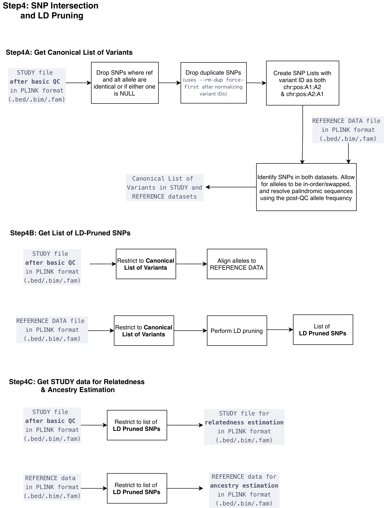

  <a href="./ind_geno_qc_step3.html">⬅️ Step 3: Basic Sample and Variant-Level QC</a>
  <a href="./ind_geno_qc_step5.html">Step 5: Relatedness Estimation ➡️</a>

[Back to Pipeline Overview](./ind_geno_qc_detailed.html)

# Step 4: SNP Intersection and LD Pruning

**Script:** `Step4_SNPIntersectAndPrune.sh`

---

## Step 4A — Get Canonical List of Variants

1. **Quality filter:** Drop SNPs where ref and alt alleles are identical or if either one is NULL
2. **Variant ID normalization:** Assign canonical `chr:pos:ref:alt` IDs to all variants. IDs already in that format are left unchanged; rsIDs, liftover artefact underscore-format IDs, and any other non-canonical IDs are rewritten.
3. **Duplicate removal:** Deduplicate with `--rm-dup force-first` — when multiple variants share the same canonical ID, the first occurrence (by position in the .bim) is retained. Normalizing IDs before this step ensures that an rsID and an underscore-format ID at the same position receive the same canonical ID and collapse here, rather than both surviving as false positives in allele harmonization.
4. **Variant ID standardization:** Create SNP lists with variant ID as both `chr:pos:A1:A2` and `chr:pos:A2:A1`
4. **SNP intersection:** Identify SNPs in both study and reference datasets — allow for alleles to be in-order or swapped, and resolve palindromic sequences using the post-QC allele frequency
5. **Output:** Canonical list of variants in STUDY and REFERENCE datasets

## Step 4B — Get List of LD-Pruned SNPs

1. **Study restriction:** Restrict study file (after basic QC) to canonical list of variants, align alleles to REFERENCE DATA
2. **Reference restriction:** Restrict reference data to canonical list of variants
3. **LD pruning:** Perform LD pruning on the reference dataset, restricting to SNPs in the intersection
4. **Output:** List of LD-pruned SNPs

## Step 4C — Get STUDY Data for Relatedness & Ancestry Estimation

1. **Study file:** Restrict post-QC study data to list of LD-pruned SNPs → produces the **STUDY file for relatedness estimation** (`.bed/.bim/.fam`)
2. **Reference file:** Restrict reference data to list of LD-pruned SNPs → produces the **REFERENCE data for ancestry estimation** (`.bed/.bim/.fam`)

---

  <a href="./ind_geno_qc_step3.html">⬅️ Step 3: Basic Sample and Variant-Level QC</a>
  <a href="./ind_geno_qc_step5.html">Step 5: Relatedness Estimation ➡️</a>

