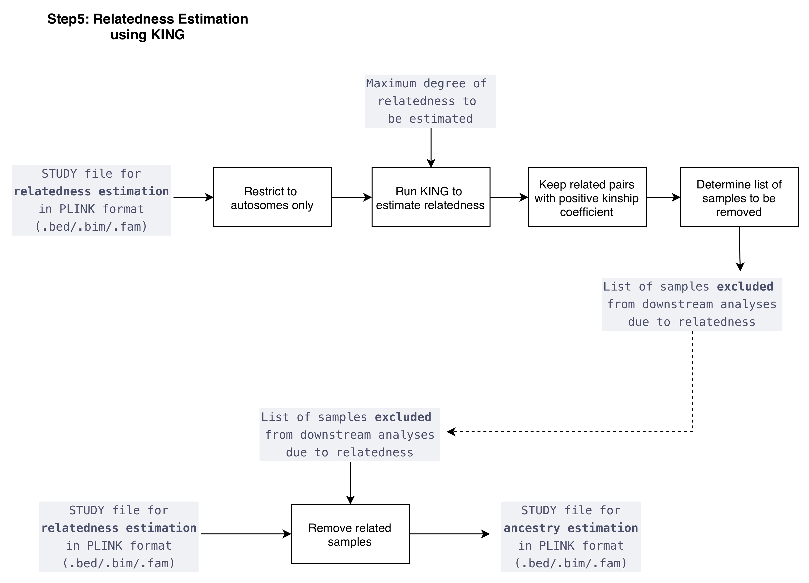

  <a href="./ind_geno_qc_step4.html">⬅️ Step 4: SNP Intersection and LD Pruning</a>
  <a href="./ind_geno_qc_step6.html">Step 6: Principal Component Analysis ➡️</a>

[Back to Pipeline Overview](./ind_geno_qc_detailed.html)

# Step 5: Relatedness Estimation

**Script:** `Step5_KinshipTest.sh` | **Report:** `./utils/report_kinship.Rmd`

---

## Implementation

1. **Autosome restriction:** Restrict study file for relatedness estimation to autosomes only
2. **KING algorithm:** Run KING via PLINK2 to estimate pairwise relatedness, parameterized by maximum degree of relatedness to be estimated
3. **Filter related pairs:** Keep related pairs with positive kinship coefficient only
4. **Sample removal selection:** For each related set with kinship > 0.354 (default), retain the sample with least missingness
5. **Relationship classification:** MZ twins, 1st/2nd/3rd degree relatives
6. **Output:** List of samples **excluded** from downstream analyses due to relatedness
7. **Create ancestry file:** Remove related samples from the STUDY relatedness file → produces the **STUDY file for ancestry estimation** (`.bed/.bim/.fam`)
8. **Visualization:** Kinship coefficient distributions and plots

---

  <a href="./ind_geno_qc_step4.html">⬅️ Step 4: SNP Intersection and LD Pruning</a>
  <a href="./ind_geno_qc_step6.html">Step 6: Principal Component Analysis ➡️</a>

