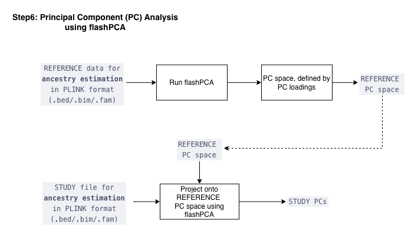

  <a href="./ind_geno_qc_step5.html">⬅️ Step 5: Relatedness Estimation</a>
  <a href="./ind_geno_qc_step7.html">Step 7: Ancestry Prediction ➡️</a>

[Back to Pipeline Overview](./ind_geno_qc_detailed.html)

# Step 6: Principal Component Analysis

**Script:** `Step6_PCA.sh` | **Utilities:** `./utils/plot_pca.R` | **Report:** `./utils/report_pca.Rmd`

---

## Implementation

1. **Reference PCA:** Run FlashPCA on REFERENCE data for ancestry estimation to generate PC space defined by PC loadings → produces the **REFERENCE PC space**
2. **Study projection:** Project STUDY file for ancestry estimation onto REFERENCE PC space using FlashPCA → produces the **STUDY PCs**
3. **PC count:** 15 PCs generated by default
4. **Sign alignment:** Ensure consistent PC orientations
5. **Visualization:** Multi-panel PC plots with population labels

## Standardized Plotting

Consistent formatting across all PCA visualizations using `./utils/plot_pca.R`.

---

  <a href="./ind_geno_qc_step5.html">⬅️ Step 5: Relatedness Estimation</a>
  <a href="./ind_geno_qc_step7.html">Step 7: Ancestry Prediction ➡️</a>

