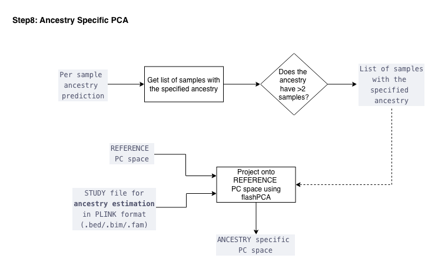

---
---

  <a href="./ind_geno_qc_step7.html">⬅️ Step 7: Ancestry Prediction</a>
  <a href="./ind_geno_qc_step9.html">Step 9: Cleanup and Reporting ➡️</a>

[Back to Pipeline Overview](./ind_geno_qc_detailed.html)

# Step 8: Ancestry-Specific PCA

**Script:** `Step8_AncestrySpecificPCA.sh`

---

## Process

1. **Ancestry filtering:** For each continental ancestry label, get list of samples with the specified ancestry from per-sample predictions
2. **Minimum sample check:** Only proceed if the ancestry group has **> 2 samples**
3. **Projection:** Project samples of selected ancestry onto REFERENCE PC space using FlashPCA
4. **Output:** Ancestry-specific PC files for downstream association analyses

---

  <a href="./ind_geno_qc_step7.html">⬅️ Step 7: Ancestry Prediction</a>
  <a href="./ind_geno_qc_step9.html">Step 9: Cleanup and Reporting ➡️</a>

