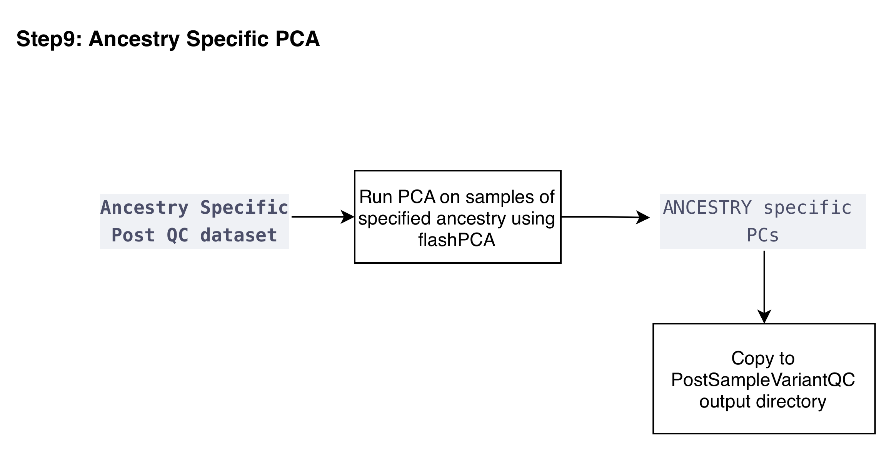

  <a href="./ind_geno_qc_step8.html">⬅️ Step 8: Finalize Outputs</a>
  <a href="./ind_geno_qc_step10.html">Step 10: Clean and Consolidate ➡️</a>

[Back to Pipeline Overview](./ind_geno_qc_detailed.html)

# Step 9: Ancestry-Specific PCA

**Script:** `Step9_AncestrySpecificPCA.sh`

---

## Process

1. **Sample count check:** Only proceed with PCA if there are at least 2 samples for the ancestry group.
2. **Run FlashPCA:** Perform PCA for each ancestry-specific subset using FlashPCA, handling cases where the number of PCs is limited by sample size.
3. **Output:** Ancestry-specific PC files for downstream association analysis

---

  <a href="./ind_geno_qc_step8.html">⬅️ Step 8: Finalize Outputs</a>
  <a href="./ind_geno_qc_step10.html">Step 10: Clean and Consolidate ➡️</a>

