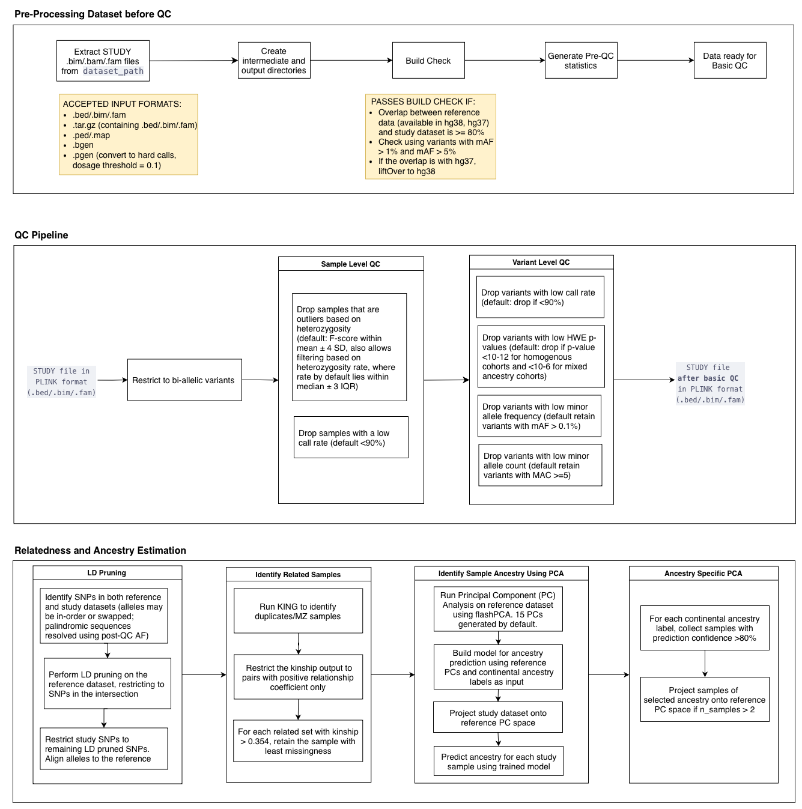

---
---

<div style="display: flex; justify-content: space-between; align-items: center;">
  <a href="./index.html">⬅️ Return to Homepage</a>
  <a href="./pre_phasing_checks.html">Go to Step 2 [Pre-Phasing Checks] ➡️</a>
</div>

# Sample Variant QC Pipeline

## Overview

This pipeline provides comprehensive quality control for genomic variant data, including automated build detection, ancestry prediction, and detailed reporting. The containerized implementation ensures reproducible execution across different computing environments.

## Features

- **Automated Build Detection** (hg37/hg38) with liftover
- **Comprehensive QC** filtering and statistics
- **Ancestry Prediction** using 1000G + HGDP reference data
- **Principal Component Analysis** for population structure
- **Kinship Analysis** to identify related samples
- **Interactive Reports** with plots and summaries
- **Containerized** execution with Docker/Singularity/Apptainer

## Requirements

- Docker, Singularity or Apptainer
- 8GB+ RAM, 50GB storage
- Linux/macOS (Windows via WSL)
- Bash shell

## Quick Start

1. **Clone the GitHub repository:**

   ```bash
   git clone git@github.com:giant-consortium/sample_variant_qc.git
   cd sample_variant_qc
   chmod +x SAMPLE_VARIANT_QC_RUNNER.sh
   ```

2. **Edit `parameters.txt`** to set paths and options for your data. The `path_to_data` and `study_name` are altered in every execution. Always set `study_name` to match the base name of your PLINK files (no file extensions).

   ```bash
   # Example: If your files are named STUDY4_SAS.bed, STUDY4_SAS.bim, STUDY4_SAS.fam
   study_name=STUDY4_SAS
   ```

   **Note:** If these are stored in a compressed form (.tar.gz) or in alternate formats (.ped/.map, .bgen) the conversion to PLINK is done automatically. Do not include the file extension in the `study_name` parameter.

3. **Run the pipeline:**

   ```bash
   # With Docker
   ./SAMPLE_VARIANT_QC_RUNNER.sh --docker

   # With Singularity
   ./SAMPLE_VARIANT_QC_RUNNER.sh --singularity

   # With Apptainer
   ./SAMPLE_VARIANT_QC_RUNNER.sh --apptainer

   # To force data download:
   ./SAMPLE_VARIANT_QC_RUNNER.sh --docker --force_data_download

   # To get the most recent containers:
   ./SAMPLE_VARIANT_QC_RUNNER.sh --docker --get_update
   ```

4. **Outputs** will be saved in a sub-folder named `study_name` at the path specified by `path_to_output` in `parameters.txt`.

### Input/Output

**Accepts:** PLINK files (.bed/.bim/.fam), BGEN, .ped/.map, compressed archives  
**Produces:** QC'd genotypes, ancestry labels, PCs, kinship results, HTML/PDF reports

### Output Structure

```bash
output/
└── STUDY_NAME_Outputs/
    ├── Ancestry/                    # Ancestry predictions and population labels
    ├── AncestrySpecificPCA/         # Population-specific principal components
    ├── Kinship/                     # Relatedness analysis results
    ├── Logs/                        # Pipeline execution logs and error messages
    ├── PCA/                         # Principal component analysis outputs
    ├── PostBasicQC/                 # Genotype files after basic QC filtering
    ├── PostQC_PerChromosome/        # QC'd data split by chromosome
    ├── PostQCStats_PerChromosome/   # QC statistics per chromosome
    ├── PostSampleVariantQC/         # Final QC'd genotype files
    ├── PreQCStats/                  # Pre-QC baseline statistics
    ├── PreQCStats_PerChromosome/    # Pre-QC statistics per chromosome
    └── Reports/                     # HTML and PDF summary reports
```

## Pipeline Overview

The pipeline performs the following steps:

1. **Setup & Format Conversion** - Convert input to PLINK format
2. **Build Detection** - Determine hg37/hg38 and liftover if needed  
3. **Pre-QC Statistics** - Generate baseline quality metrics
4. **Basic QC** - Filter samples/variants (Default: call rate, MAF, HWE)
5. **Kinship Analysis** - Identify related samples using KING
6. **SNP Intersection** - Align with reference data for PCA
7. **PCA Generation** - Calculate population structure covariates
8. **Ancestry Prediction** - Assign continental ancestry labels
9. **Ancestry-Specific PCA** - Generate population-specific PCs
10. **Reporting** - Create comprehensive HTML/PDF reports

## Workflow Diagram



## Default QC Thresholds

- **Build check:** Requires ≥80% variant overlap between study and reference data (tested with no MAF threshold, MAF>1% and MAF>5%)
- **Sample call rate:** 90% (0.9)
- **Variant call rate:** 90% (0.9)  
- **Minor allele frequency:** 1% (0.01)
- **Hardy-Weinberg equilibrium:** p > 1e-50
- **Sample heterozygosity:** within 3 IQR of median
- **Kinship threshold:** 0.354 (MZ twins/duplicates only)
- **Ancestry prediction algorithm:** MANCS (Multi-Ancestry Nearest Control Selection)
- **Ancestry confidence:** 80% (0.8)

*All thresholds are customizable via `parameters.txt`*

## Reference Data

Uses harmonized 1000 Genomes + HGDP data:

- 3,280 samples, 8.15M high-quality variants
- Continental ancestry labels (AFR, AMR, EAS, EUR, SAS)
- Available in hg37 and hg38 builds

## Troubleshooting

- Check the log files in the `./output/study_name/Logs` directory for errors.
- Ensure all required paths in `parameters.txt` are correct and accessible.
- Stepwise outputs are in the `./output/study_name/` directory.
- For container issues, verify your container runtime is installed and running.

---

**Note:** For detailed step-by-step documentation, see [GIANT_IndGenoQCSteps_DeeperImputation](detailed_steps/ind_geno_qc_detailed.md)

---

[ Return to Homepage](README.md)
