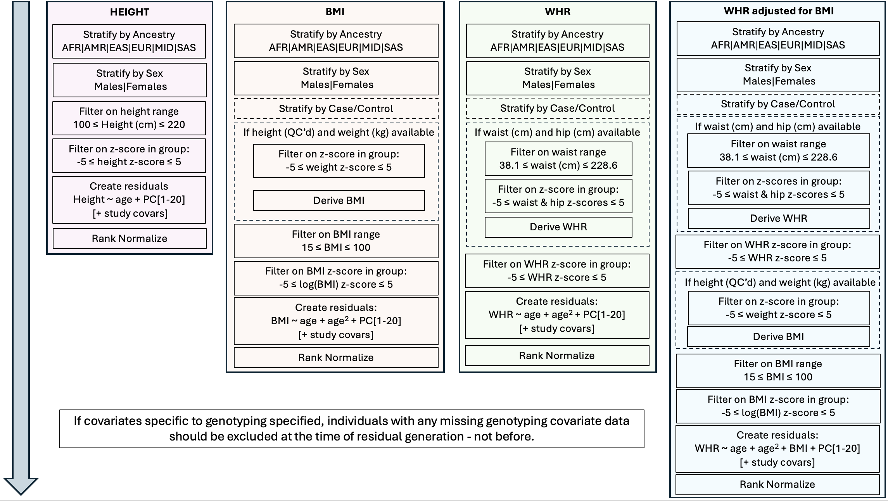

<div style="display: flex; justify-content: space-between; align-items: center;">
  <a href="./index.html">⬅️ Return to Homepage</a>
  <a href="./gwas.html">Go to Step 4 [Genome Wide Association Study] ➡️</a>
</div>

# Phenotype Pipeline

## Overview

This repository provides a containerized pipeline for QC and deriviation of phenotype data for subsequent GWAS analysis.
The dependencies for the pipeline are distributed as a .sif file that can be run using apptainer/singularity. 

## Usage

1. **Clone the pre-phasing/imputation repo from GitHub**
   ```
   git clone git@github.com:giant-consortium/phenotype_processing.git
   ```

2. **Navigate to `phenotype_processing/` directory**
   ```
   cd phenotype_processing/
   ```

3. **Edit `parameters.txt` to set filenames and options for your data.** This includes mapping column names to data labels that can be interpreted by the pipeline.

4. **Run the pipeline**. This will download the container if it does not already exist in the working directory. 
You should specify whether you would like to use Apptainer or Singularity to run the container.

    ```
    # Run container using Apptainer
    bash PHENOTYPE_PIPELINE.sh --apptainer
    
    # Run container using Singulairty
    bash PHENOTYPE_PIPELINE.sh --singularity
    ```

5. **Outputs** will be saved in the directory specified by `out_dir` in parameters.txt. Two sub-directories will be created:

  * `regenie_input/`
    * primary phenotype file
    * additional covariate file associated with genotyping / imputation process
    * subject lists to stratify individuals by ancestry and sex

  * `summaries/`
    * tabular summaries of phenotypes, split by each phenotype and ancestry
    * png file plotting histograms and box plots of distributions of pre-QC'd, QC'd, residuals, and rank normal values for GWAS


## Details

### Overview of phenotype preparation for GWAS


### 1. Files required
The script expects 3 files for input to be specified in the `parameters.txt` file.
```
## Filename containing phenotype and covariate data (required)
PHENO_COV_FILE="/path/to/PhenoCovars.txt"

## Filename containing ancestry labels [AFR|AMR|EAS|EUR|MID|SAS] (required)
ANCESTRY_FILE="/path/to/Ancestries.txt"

## Filename containing 20 study-level PCs generated by FLASH PCA (required)
PCS_FILE="/path/to/FlashPCAStudyPCA.txt"
```
##### Phenotype + covariate file
This file should be a tab-delimited file with header that contains all variables for phenotype derivation for height, BMI and WHR, and all associated covariates. 

```
ID    Age   Sex  Height  Weight  Waist  Hip    CatVar1  CatVar2  CatVar3
P1    25    2    99      75.6    89     100    0        1        1
P2    85    1    170     89.8    91     98     1        1        2
P3    36    2    159     91.1    84     1020   0        2        3
...
```
##### Ancestry label file - from Individual and Genotype QC Pipeline
This file should be a tab-delimited file with the header as shown with ancestry group assignment provided for each individual
```
IID     Ancestry
P1      EUR
P2      EUR
P3      EUR
...
```
##### Principal components file - from Individual and Genotype QC Pipeline
This file should be a tab-delimited file with 20 PCs (FLASHPCA output format)
```
IID   FID   PC1          PC2          PC3            ...    PC18         PC19         PC20          
P1    1     0.722770917  0.422132091  0.516251618    ...    0.05984563   0.74798664   0.310145635
P2    2     0.584095559  0.154674118  0.243537544    ...    0.059630973  0.708644846  0.863891645
P3    3     0.709639726  0.926419979  0.041459368    ...    0.613060395  0.315596588  0.719991385
...
```


### 2. Derivation of phenotypes
Where possible, please provide variables to derive phenotypes are required:

| Phenotype | Variables to priortise if available |
| :---: | :---: |
| **HEIGHT** | height (cm) |
| **BMI** | height (cm), weight (kg) |
| **WHR** | waist circumference (cm), hip circumference (cm) |

Note, WHR adjusted for BMI GWAS will be derived by the pipeline.

If you do not have measures of weight, waist and/or hip, pre-derived values for BMI and WHR can be used and these will be QC'd. 
A mixture of non-derived and pre-derived WHR and BMI values are allowed but if both are provided for a given primary GWAS, 
the pipeline with prioritise derivation of phenotypes over pre-derived phenotypes. For example, if height is provided alongside both weight and BMI, then the primary BMI GWAS
will based on deriving BMI from height and weight - the pre-defined BMI variable will be ignored. 


#### Quality control
Variables used to derive BMI and WHR will first undergo QC prior to derivation of BMI and WHR that will subsequently be QC'd again.

Details of quality control applied to variables can be found in the following table. 
Z-scores are calculated within ancestry-sex specific strata, or within ancestry-sex-case/control strata for BMI and WHR if case/control labels are provided. 

| Variable / Phenotype | Range Inclusion | Z-score Inclusion |
| :---:       | :---:              | :---: |
| **HEIGHT**    | 100 - 220 (cm)    | -5 < z < 5 |
| **BMI**       | 15 - 100          | -5 < z(log BMI) < 5 |
| **WHR**       | NA               | -5 < z < 5 |
| **WHRadjBMI** | NA               | -5 < z < 5 |
| **WEIGHT**    | NA               | -5 < z < 5 |
| **WAIST**     | 38.1 - 228.6 (cm) | -5 < z < 5 |
| **HIP**       | NA               | NA |
| **AGE**       | 18-110 (years)    | NA |


#### Allowing for differences in timing when measurements taken
To account for the nature of EHR-based studies and other longitudinal studies,
two sets of variables may be provided for BMI and WHR if the variables related to the BMI GWAS and WHR GWAS differ from those related to WHRadjBMI GWAS. 
If the same variable is to be used, then you can specify the same column header for each
 
Parameters that enable multiple measures:
```
### WEIGHT - EXAMPLE: DIFFERENT MEASURES TO DERIVE BMI FOR BMI AND WHRadjBMI GWAS

## Column containing weight (kg) to derive phenotype for primary BMI GWAS
weight_for_bmi_col="weight_baseline"

## Column containing weight (kg) values to derive BMI for WHRadjBMI GWAS
weight_for_whradjbmi_col="weight_followup"


### WAIST - EXAMPLE: DIFFERENT MEASURES TO USE FOR WHR AND WHRadjBMI

## Column containing waist circumference (cm) for WHR GWAS
waist_for_whr_col="waist_baseline"

## Column containing waist circumference (cm) for WHRadjBMI GWAS
waist_for_whradjbmi_col="waist_followup"


### HIP = EXAMPLE: SAME MEASURES

## Column containing hip circumference (cm) for WHR GWAS
hip_for_whr_col="hip_baseline"

## Column containing hip circumference (cm) for WHRadjBMI HWAS
hip_for_whradjbmi_col="hip_followup"


### PRE-DERIVED BMI - EXAMPLE: SAME MEASURES

## Column containing pre-derived BMI values
bmi_col="BMI"

## Column containing pre-derived BMI values to adjust for
bmi_for_whradjbmi_col="BMI"


### PRE-DERIVED BMI - EXAMPLE: SAME MEASURES

## Column containing pre-derived WHR values 
whr_col="WHR"

## Column name containing pre-derived WHR values for adjustment
whr_for_whradjbmi_col="WHR"
```

As a result, the pipeline allows for different ages for height, BMI, WHR and WHRadjBMI to be provided. 
If the same values are to be used, then you can specify the same column header for each

Parameters that enable multiple ages:
```
## Column with age at height measurement for height GWAS
age_height_col="Age"

## Column with age at weight measurement or derived BMI for BMI GWAS
age_bmi_col="Age"

## Column with age at waist and hip measurement or pre-derived WHR for WHR GWAS
age_whr_col="Age"

## Column with age at weight measurement or derived BMI, 
#  and waist and hip measurement or pre-derived WHR for WHRadjBMI GWAS
age_whradjbmi_col="Age"
```

